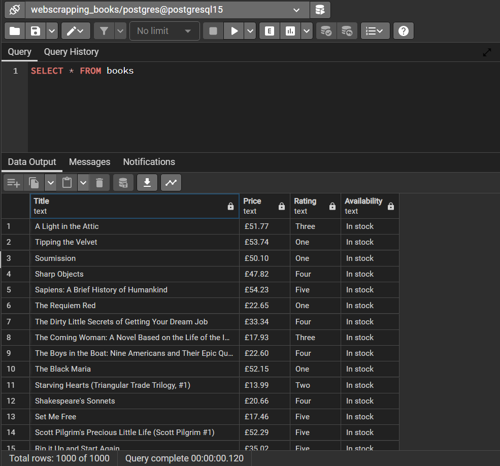

# webscraping-beautifulsoup-pandas

Web scraping a fake book store page - https://books.toscrape.com/

* Using beautifulsoup to scrape HTML page
* Pandas to convert list to dataframe
* Saving dataframe as CSV file and writing data to a postgreSQL table

